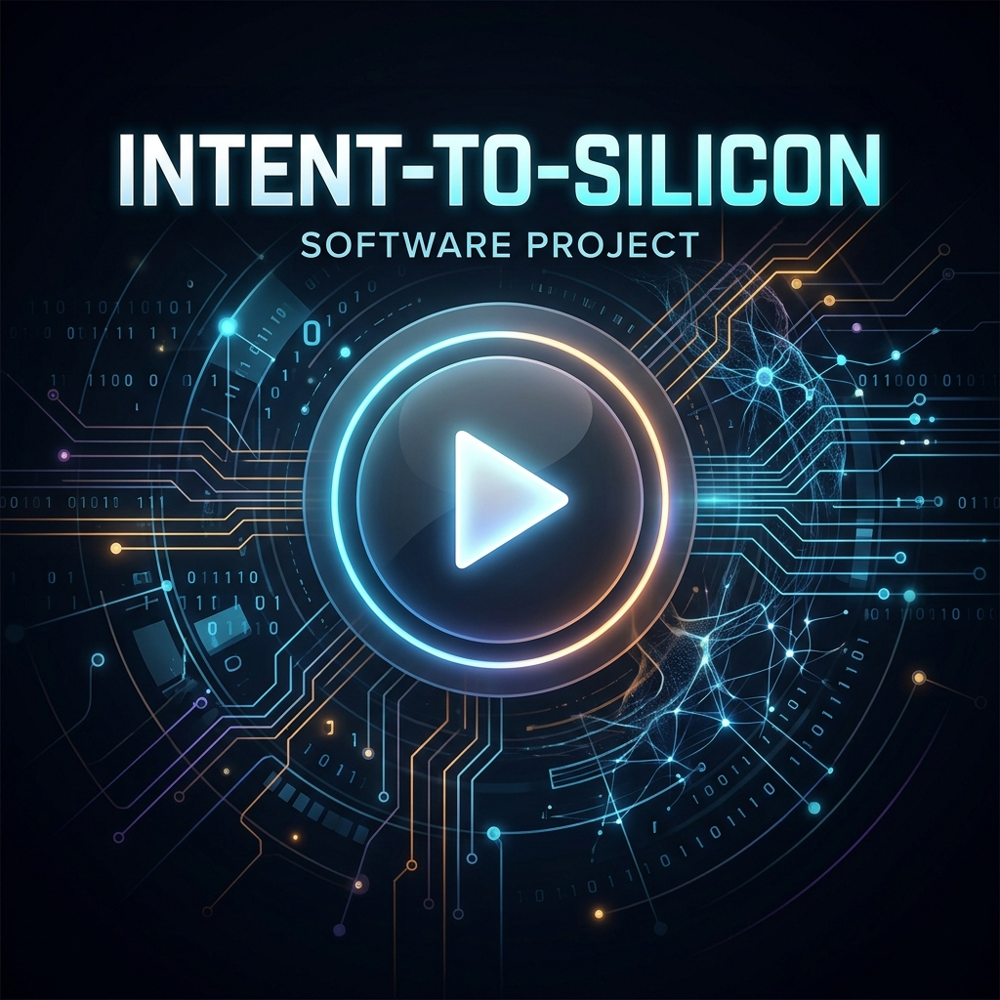

# INTENT-TO-SILICON
[](https://doi.org/10.5281/zenodo.20668914)

## Compiler-Less Computing via Multi-Layer Human Language Translation

> *"Programming languages are not the final interface between humans and computers. Human thought — in any language — should be enough."*
> 
> — Ayush Kumar Mishra (Ayush Kaushik), June 2026

---

## 🎥 Demo Video

[](https://github.com/Minato95-ayu/INTENT-TO-SILICON/blob/main/media/demo.mp4)

---

## About This Research

This repository contains the original research, concept notes, voice transcripts, and implementation plans for **Intent-to-Silicon** — a novel framework that enables any person to build software by simply describing their idea in their native language (Hindi, Hinglish, Urdu, English, or any other language), without writing a single line of code.

---

## The Core Idea

Traditional programming languages like Python, Java, and C++ are **intermediate translators** — legacy interfaces designed to bridge the gap between human thought and machine execution. They exist because computers need exact, mathematically precise commands.

**The Ultimate Vision: Human Language AS the Coding Language**
This research does not aim to build another Python library or chatbot. The goal is to elevate **Human Languages (Hindi, English, Sanskrit, etc.)** to the semantic exactness of programming languages. We are building a massive semantic dictionary/library where every human word maps to an exact binary/technical execution. 

The end goal is a **Direct Human-to-Binary Translator** (and Binary-to-Human). Any Python code written in this repository (like the Chatbot PoC) is strictly a **simulation/mockup** to demonstrate how the final compiler will behave. The true core of the research is the creation of the Semantic Library.

This research proposes replacing the programming language workaround with a **7-layer AI translation pipeline** that:

1. Understands what the user wants — in any language
2. Asks smart clarifying questions — one at a time, never frustrating
3. Matches vague words to precise technical specifications via a **Hinglish-to-Technical Dictionary**
4. Structures the requirements into a formal specification
5. Automatically generates software architecture
6. Translates to executable code
7. Returns results back in the user's own language

---

## Research Methodology & Metrics

This project does not aim to build a new LLM. It focuses entirely on solving the **"Human → Intent"** bottleneck.

> **"Garbage Intent In → Garbage Output Out"**

**Core Defendable Claim:** This framework significantly reduces ambiguity-driven AI errors by translating vague human language into precise technical specifications *before* code generation begins. 

*Programming languages remove ambiguity for computers. This system removes ambiguity from human language.*

Success is measured strictly by empirical data:
- **Baseline:** Percentage of correct specs generated from raw prompts.
- **Target:** 90%+ correct specs using the 7-Layer Pipeline.

📖 **Read the full philosophy and metrics here:** [Research Methodology & Core Arguments](paper/Research_Methodology.md)

---

## Original Contributions

These ideas were developed independently by Ayush Kumar Mishra and first documented in June 2026:

- **The "Thoda Namak" Insight** — Human language is ambiguous by design. "Add a little salt" means different things in different contexts. The solution is not to avoid natural language — it is to resolve ambiguity through structured dialogue.

- **The Principal Letter Analogy** — Just as a formal letter has a fixed format (Subject, Date, Body, Signature) that removes ambiguity, software specifications need a controlled format that converts vague human intent into precise machine instructions.

- **Dictionary + Cross-Question = Ambiguity Reduction Framework** — By systematically removing ambiguity *before* code generation through smart cross-questioning and a semantic dictionary, the system significantly improves requirement precision.

- **Bidirectional Translation Pipeline** — The same translation process that converts human language to binary must work in reverse — converting machine output back into the user's natural language.

- **Hinglish-to-Technical Semantic Dictionary** — A novel dictionary mapping colloquial South Asian expressions to precise engineering specifications, designed for India's 550 million Hindi speakers.

---

## Timeline of Discovery

- **June 2026:** Initial Idea conceptualized
- **June 10, 2026:** Original Hindi Voice Notes recorded
- **June 11, 2026:** 7-Layer Architecture Draft formulated
- **June 12, 2026:** Research Paper v1 documented, GitHub Repository initialized

---

## Why This Matters

**550 million people** speak Hindi in India. Only a fraction know how to code.

A farmer with a crop-tracking idea. A shopkeeper who needs an inventory system. A teacher who wants an attendance app. A grandmother who wants to share family photos.

None of them should need to learn Python.

This research builds the bridge that lets them simply *describe* what they want — and have it built.

---

## Research Architecture

```
User speaks in any language (Hindi / Urdu / English / Hinglish)
                        ↓
           LAYER 1 — Intent Understanding
        Detect language, capture intent, find ambiguity
                        ↓
           LAYER 2 — Intent Validation
        Confirm understanding before proceeding
                        ↓
           LAYER 3 — Active Disambiguation Engine
        Ask ONE question at a time — never frustrate
        Uses a rule-based deterministic clarification matrix
        (Acknowledge → Isolate → Determine Impact)
                        ↓
           LAYER 4 — Semantic Dictionary Lookup
        Match vague words to precise specs:
        "fast"   → response < 200ms
        "secure" → HTTPS + JWT + AES-256
        "simple" → max 3 clicks to goal
                        ↓
           LAYER 5 — Requirement Structuring
        Principal-letter-style format:
        every field in the right place
                        ↓
           LAYER 6 — Architecture Generation
        Auto-select database, server, components
                        ↓
           LAYER 7 — Code + Execution
        Generate, compile, run
                        ↓
        Result returned in user's own language

---

## 🧠 Cognitive Expansion (v0.6 & v0.7) — Experimental

> **Note:** These features are early-stage prototypes and have **not been benchmark-validated** yet. They are included as proof-of-concept code demonstrating the research direction.

- **v0.6 Context Awareness (Experimental):** Profiles users based on past behavior (e.g., risk tolerance) to dynamically adapt and personalize cross-questions.
- **v0.7 Continuous Active Learning (Experimental):** Detects OOV (Out-of-Vocabulary) slang, prompts the user for clarification, and registers it in a localized dictionary for future use.

---

## Hinglish-to-Technical Dictionary (Sample)

| User Says (Hinglish) | System Understands | Technical Specification |
|---|---|---|
| Ekdum fast chahiye | Ultra-low latency | P99 Latency < 200ms; CDN enabled |
| Secure rehna chahiye | Security required | HTTPS + JWT + AES-256 encryption |
| Bahut public aayegi | High traffic expected | Auto-scaling + Load Balancer |
| Sirf main dekh sakun | Private access | RBAC + private subnet |
| Payment bhi lena hai | Payment gateway | Razorpay/Stripe + PCI-DSS |
| Offline bhi kaam kare | Offline-first | Service Workers + IndexedDB |
| Real-time update chahiye | Live sync | WebSockets + Redis pub-sub |
| Simple chahiye | Minimal UI | Max 3 clicks to complete any task |

Full dictionary: see `dictionary/hinglish_technical_map.csv`

---

## Repository Contents

```
INTENT-TO-SILICON/
│
├── README.md                          ← You are here
│
├── paper/
│   ├── Intent_to_Silicon_v2.md        ← Full research paper v2
│   └── main.tex                       ← LaTeX source for arXiv
│
├── prototype/
│   ├── nlp_engine.py                  ← Core NLP Engine (rule-based intent extraction)
│   ├── chat_engine.py                 ← Terminal simulation for interactive testing
│   └── continuous_learning_engine.py  ← v0.7 OOV learning loop (experimental)
│
├── dictionary/
│   ├── nlp_semantic_library.json      ← Functional constraints map (performance, security, scale)
│   ├── pain_point_taxonomy.json       ← Emotional UX heuristics map (v0.12, with meanings)
│   ├── semantic_library.json          ← Legacy semantic library
│   └── hinglish_technical_map.csv     ← Quick-reference Hinglish-to-Technical lookup
│
├── experiments/
│   ├── benchmark_runner.py            ← Headless empirical evaluation script
│   ├── benchmark_report.md            ← Latest benchmark results
│   ├── social_media_miner.py          ← v0.11 Data ingestion pipeline (synthetic)
│   ├── run_benchmarks.py              ← Legacy benchmark script
│   └── generate_mock_dataset.py       ← Synthetic dataset generator
│
├── data/
│   ├── mock_pain_points_dataset.json  ← Synthetic benchmark phrases (N=28)
│   ├── raw_social_media_dump.json     ← Simulated social media reviews
│   ├── proposed_new_patterns.json     ← Miner output (pending human review)
│   └── user_profiles.json             ← Context profiling data (experimental)
│
└── output/                            ← Generated YAML blueprints
```

---

## Current Status & Architecture Progress

> **Transparency Note:** All benchmarks are currently run against **synthetic (self-authored) test phrases (N=28)**, not real-world user data. The disambiguation engine is **rule-based and deterministic**, not probabilistic or Bayesian. The social media mining pipeline uses **simulated data**, not actual scraped content. These are honest limitations of a research prototype.

### ✅ Phase 1: Input & Understanding (Complete)
- **User Input (Hindi/Hinglish):** Ingests raw, unstructured, and colloquial frustration phrases.
- **Semantic Libraries (v0.12):** `pain_point_taxonomy.json` stores every Hinglish slang with its exact technical UX meaning.

### ✅ Phase 2: Safety & Halting (Complete)
- **Safe-Halting Policy:** If the intent engine fails to map user phrases to known heuristics, it halts execution instead of hallucinating logic.
- **Empirical Benchmarks:** Intent recognition accuracy on synthetic benchmark (N=28).

### ✅ Phase 3: Disambiguation (Complete)
- **Active Disambiguation Engine:** A rule-based 3-step structured clarification matrix: `Acknowledge → Isolate → Determine Impact`.
- **Dataset Scaling (v0.11):** A simulated data ingestion pipeline that demonstrates how real-world phrases could be proposed for taxonomy expansion with human-in-the-loop validation.

### ⏳ Phase 4 & 5: Output Layer & Silicon Generation (Not Started)
- **YAML Blueprint (Next Milestone):** Converting the locked NLP intent into a strict, machine-readable YAML specification.
- **Executable Code:** Future phase to pipe the YAML Blueprint into a code-generation engine.

### Known Limitations
- Benchmark dataset is small (N=28) and self-authored. Real-world user testing has not been conducted.
- The engine uses keyword/substring matching, not deep NLP (no embeddings, no transformers).
- Layers 5-7 (Requirement Structuring, Architecture Generation, Code Execution) are conceptual and not yet implemented.

---

## Proof of Original Authorship

| Evidence | Details |
|---|---|
| Voice Recording | Original Hindi explanation recorded June 2026 — available in `/transcripts/` |
| GitHub Timestamp | This repository created June 2026 |
| Conversation History | Full research development conversation — documented |
| Original Analogies | "Thoda namak" + "Principal letter" — unique to this author |

---

## Author

**Ayush Kumar Mishra** (also known by pen name **Ayush Kaushik**)

B.Sc. Mathematics Honours — Delhi, India

Self-taught full-stack developer and AI builder. Founder of [Adumate.in](https://adumate.in) — a student services platform.

- GitHub: [github.com/Minato95-ayu](https://github.com/Minato95-ayu)
- Twitter: [x.com/o_Ayush_kaushik](https://x.com/o_Ayush_kaushik)
- LinkedIn: [linkedin.com/in/ayushh-kaushiq-1a950825a](https://linkedin.com/in/ayushh-kaushiq-1a950825a)
- Email: ayushkaushik1441@gmail.com

---

## License

**Creative Commons Attribution 4.0 International (CC BY 4.0)**

You are free to share and adapt this work — but you **must give credit** to Ayush Kumar Mishra and link back to this repository.

Full license: [creativecommons.org/licenses/by/4.0](https://creativecommons.org/licenses/by/4.0)

---

## AI Assistance Disclosure

In the spirit of academic honesty:

Core ideas, original insights, analogies, and research direction were developed by Ayush Kumar Mishra through independent thinking and verbal explanation in Hindi.

Claude AI (Anthropic) and Gemini (Google DeepMind) were used for formatting assistance, technical terminology lookup, and paper structuring — similar to how a researcher uses a writing assistant or LaTeX template.

**The thinking is human. The original voice is human. The research is human.**

---

## Citation

If you use or reference this work:

```
Mishra, A. K. (2026). Intent-to-Silicon: Compiler-Less Computing via 
Multi-Layer Human Language Translation. GitHub Repository. 
https://github.com/Minato95-ayu/INTENT-TO-SILICON
```

---

*First commit: June 2026 | © 2026 Ayush Kumar Mishra | CC BY 4.0*
