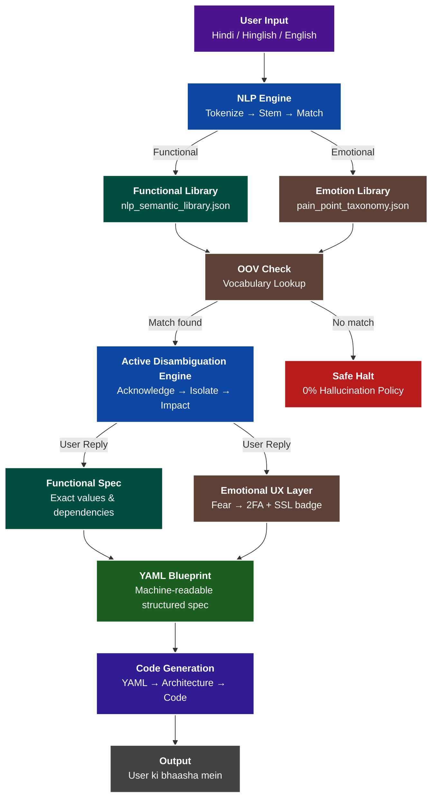

# 🚀 INTENT-TO-SILICON

[](https://doi.org/10.5281/zenodo.20668914)
[](https://www.python.org/downloads/)
[]()

### Compiler-Less Computing via Multi-Layer Human Language Translation

> *"Programming languages are not the final interface between humans and computers. Human thought — in any language — should be enough."*  
> — Ayush Kumar Mishra (Ayush Kaushik), June 2026

---

## 🎯 The Core Idea

Traditional programming languages are legacy interfaces designed for computers, not humans. **Intent-to-Silicon** is a revolutionary framework that elevates human language (Hindi, Hinglish, English, etc.) to the semantic exactness of programming languages.

Instead of writing code, a user simply describes their problem in their native language (e.g., *"paise kat gaye"* or *"app hang ho gaya"*). The system uses a **7-Layer AI Translation Pipeline** and a **Hinglish-to-Technical Dictionary** to automatically generate precise, execution-ready software architecture without hallucination.

---

## 📊 Current Status

```text
Research Paper         ✅ Complete
Voice Transcript       ✅ Documented  
Dictionary             ✅ 4 files — pain_point_taxonomy, 
                          nlp_semantic_library, semantic_library,
                          hinglish_technical_map
Prototype              ✅ nlp_engine.py, chat_engine.py,
                          continuous_learning_engine.py
Experiments            ✅ Benchmarks 28/28 passing (100% Accuracy)
Versions Completed     ✅ v0.4 → v0.12
arXiv Submission       ⏳ Planned — Month 2
Conference — ICON 2026 ⏳ Planned — October
```

---

## 💻 How to Run (The Prototype)

> ⚠️ **Wait, why are we using Python?**  
> We are **NOT** asking the user to code in Python. The end-user of this framework will *only* speak Hindi/English.  
> Just like the first C++ compiler was written in C, the first prototype of our "Human-to-Binary" translator is currently being built using Python. Python is just the factory building the machine; the machine itself only understands Human Language.

### Requirements
* Python 3.8+ (For running the prototype engine)
* No external libraries needed — pure Python!

### Run Chat Engine (Interactive Translation)
```bash
python prototype/chat_engine.py
```

### Run Benchmarks (Empirical Testing)
```bash
python experiments/benchmark_runner.py
```

### Run NLP Engine (Headless Processing)
```bash
python prototype/nlp_engine.py
```

---

## 🏗️ Architecture Flowchart

Below is the complete architectural roadmap of how human intent is converted into silicon-ready code.



---

## 🧠 The 7-Layer Translation Pipeline

1. **Intent Understanding**: Detect language and capture ambiguous intent.
2. **Intent Validation**: Confirm understanding before proceeding.
3. **Active Disambiguation**: A rule-based clarification matrix that asks exactly one highly-targeted question.
4. **Semantic Dictionary Lookup**: Matches vague words to precise specs (*"fast"* → `< 200ms latency`).
5. **Requirement Structuring**: Converts locked intent into a machine-readable YAML Blueprint.
6. **Architecture Generation**: Auto-selects databases, servers, and UX components.
7. **Code Execution**: Compiles and runs the generated code.

---

## 📂 Repository Contents

```text
INTENT-TO-SILICON/
│
├── README.md                          ← You are here
├── paper/
│   ├── Intent_to_Silicon_v2.md        ← Full research paper v2
│   └── main.tex                       ← LaTeX source for arXiv
├── prototype/
│   ├── nlp_engine.py                  ← Core NLP Engine
│   ├── chat_engine.py                 ← Terminal simulation
│   └── continuous_learning_engine.py  ← v0.7 OOV learning loop (experimental)
├── dictionary/
│   ├── nlp_semantic_library.json      ← Functional constraints map
│   ├── pain_point_taxonomy.json       ← Emotional UX heuristics map
│   ├── semantic_library.json          ← Legacy semantic library
│   └── hinglish_technical_map.csv     ← Quick-reference dictionary
├── experiments/
│   ├── benchmark_runner.py            ← Headless empirical evaluation script
│   ├── benchmark_report.md            ← Latest benchmark results (100% Acc)
│   ├── social_media_miner.py          ← v0.11 Data ingestion pipeline
│   ├── run_benchmarks.py              ← Legacy benchmark script
│   └── generate_mock_dataset.py       ← Synthetic dataset generator
├── data/
│   ├── mock_pain_points_dataset.json  ← Synthetic benchmark phrases (N=28)
│   ├── raw_social_media_dump.json     ← Simulated social media reviews
│   ├── proposed_new_patterns.json     ← Miner output
│   └── user_profiles.json             ← Context profiling data (experimental)
└── output/                            ← Generated YAML blueprints
```

> **Transparency Note:** All benchmarks are currently run against **synthetic (self-authored) test phrases (N=28)**. The disambiguation engine is **rule-based and deterministic**. The social media mining pipeline uses **simulated data**. These are honest limitations of a research prototype.

---

## 📜 Proof of Original Authorship

| Evidence | Details |
|---|---|
| **Voice Recording** | Original Hindi explanation recorded June 2026 — available in `/transcripts/` |
| **GitHub Timestamp** | This repository created June 2026 |
| **Original Analogies** | "Thoda namak" + "Principal letter" concepts are unique to this author |

---

## 👤 Author

**Ayush Kumar Mishra** (Pen name: **Ayush Kaushik**)  
*B.Sc. Mathematics Honours — Delhi, India*  
Self-taught full-stack developer, AI builder, and Founder of [Adumate.in](https://adumate.in).

* **GitHub:** [github.com/Minato95-ayu](https://github.com/Minato95-ayu)
* **X (Twitter):** [x.com/o_Ayush_kaushik](https://x.com/o_Ayush_kaushik)
* **Email:** ayushkaushik1441@gmail.com

---

**License:** [Creative Commons Attribution 4.0 International (CC BY 4.0)](https://creativecommons.org/licenses/by/4.0)  
*First commit: June 2026 | © 2026 Ayush Kumar Mishra*
