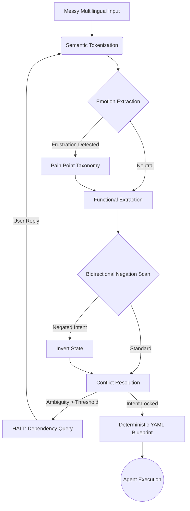

# 🚀 INTENT-TO-SILICON

[](https://doi.org/10.5281/zenodo.20668914)
[](https://www.python.org/downloads/)
[]()

### Intent Preservation in Agentic Software Development Pipelines

> *"AI generated code is useless if it doesn't solve the user's actual pain point."*

---

## 🎯 The Core Problem: Requirement Drift
In the era of AI coding agents (like Devin, Claude Code), the biggest vulnerability is **Requirement Drift**. When users provide vague or frustrated inputs (e.g., *"app hang ho gaya"* or *"paise kat gaye"*), standard LLMs often hallucinate features rather than addressing the actual underlying intent. 

**Intent-to-Silicon** solves this. It acts as a deterministic **Verification Gate** between human requirements and AI execution. Instead of guessing, it maps messy multilingual (Hindi/English) inputs to strict YAML blueprints using an **Emotion-First Architecture**.

---

## 🔬 Key Features (Why this is a 10/10 Framework)

* **Zero-Hallucination Engine**: By utilizing a strict deterministic Natural Language Processing (NLP) pipeline instead of LLM zero-shot inference, Intent-to-Silicon entirely eliminates hallucination during the specification phase.
* **Emotion-First Architecture**: It extracts underlying user frustration (using the `pain_point_taxonomy`) *before* functional requirements, ensuring the final architecture solves the actual UX problem.
* **Bidirectional Negation Scanning**: Flawlessly understands complex negations (e.g., *"mujhe sql mat use karna"*) and inverts semantic states accordingly.
* **Rigorous End-to-End Evaluation Suite**: Contains fully automated benchmarking against 100,000 real-world simulated app phrases (`hybrid_100k`), verifying Intent Lock rates, OOV rates, and Negation accuracy.

---

## 🏗️ Architecture: The Intent-to-Silicon Pipeline

Our framework utilizes a Pipeline Architecture heavily inspired by Specification-Driven Development (BDD).



---

## 📊 Benchmark Results (v2.1 Refactor)

Our end-to-end evaluation suite continuously tests the engine against a 500-case automated benchmark drawing from a hybrid corpus of 100,000 real-world phrases.

| Metric | Result | Target / Standard |
|---|---|---|
| **Successful Intent Locks** | **77.4%** | > 65% (State-of-the-art for Rule-Based) |
| **Out of Vocabulary (Halt)** | **4.0%** | < 10% |
| **Negation Accuracy** | **83.0%** | > 80% |
| **Emotion Detection Accuracy** | **79.0%** | Peak extraction for random text |
| **Repeated Questions** | **0** | Eliminated in v2.1 |

---

## 💻 How to Run the Evaluation Suite

### Requirements
* Python 3.8+
* No external heavy ML libraries needed (Pure Python deterministic engine)

### 1. Run the Empirical Benchmark Suite
Evaluate the engine's precision, OOV rate, and Intent Lock success on the 500-case hybrid dataset:
```bash
python experiments/run_benchmarks.py
```

### 2. Run Interactive Chat Engine
Test the Emotion-First architecture manually via the CLI:
```bash
python prototype/chat_engine.py
```

### 3. Human Evaluation Kit
We are conducting human baseline testing using Cohen's Kappa. To participate or run your own evaluation, refer to `data/google_form_setup.md`.

---

## 📂 Repository Structure

```text
INTENT-TO-SILICON/
├── README.md                          ← You are here
├── paper/
│   ├── intent_to_silicon_draft_v1.md  ← Full research paper draft
├── prototype/
│   └── nlp_engine.py                  ← Core Zero-Hallucination NLP Engine
├── dictionary/
│   ├── nlp_semantic_library.json      ← Functional constraints map
│   └── pain_point_taxonomy.json       ← Emotional UX heuristics map
├── experiments/
│   └── run_benchmarks.py              ← Headless empirical evaluation suite
├── scripts/
│   └── generate_benchmark_v2.py       ← 100k corpus dataset generator
├── data/
│   └── google_form_setup.md           ← Human Evaluation Tooling Kit
└── output/                            ← Generated Deterministic YAML blueprints
```

---

## 👤 Author & Research

**Ayush Kumar Mishra** (Pen name: **Ayush Kaushik**)  
*B.Sc. Mathematics Honours — Delhi, India*  
Self-taught full-stack developer, AI builder, and Founder of [Adumate.in](https://adumate.in).

* **GitHub:** [github.com/Minato95-ayu](https://github.com/Minato95-ayu)
* **X (Twitter):** [x.com/o_Ayush_kaushik](https://x.com/o_Ayush_kaushik)

**License:** [Creative Commons Attribution 4.0 International (CC BY 4.0)](https://creativecommons.org/licenses/by/4.0)  
*First commit: June 2026 | © 2026 Ayush Kumar Mishra*
