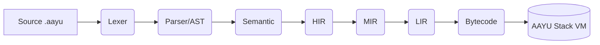

<div align="center">
  
  <h1>AAYU Programming Language</h1>
  <p><strong>Intent-to-Silicon: The Zero-Dependency, Full-Stack Programming Language.</strong></p>
  <p>
    <a href="https://intent-to-silicon.vercel.app">Website & Docs</a> • 
    <a href="https://intent-to-silicon.vercel.app/tutorial">Masterclass Tutorial</a>
  </p>
  <p>
    
    
    
    
  </p>
</div>

---

## ⚡ What is AAYU?

**AAYU** (created by Ayush Ghrit Kaushik) is a revolutionary programming language designed to eliminate modern development bloat. Instead of managing complex stacks (React + Node + SQL + PyTorch), AAYU gives you a complete, high-performance ecosystem in a **single `.aayu` file**.

AAYU compiles your intent directly into optimized bytecode executed by its custom Stack-based Virtual Machine.

### 🔥 Core Capabilities (Built-in)
- 🗄️ **Zero-Config Database:** Native SQLite engine with auto-migrations.
- 🌐 **ASGI Web Server:** High-speed HTTP server built directly into the runtime (`--web`).
- 🎨 **Declarative UI:** Native widget tree (Page, Column, Button) rendering to HTML/CSS.
- 🧠 **Native AI/ML Engine:** Train K-Means and Neural Nets *without* external dependencies.
- 🎮 **Game Engine:** Render 2D canvas, sprites, and physics natively.
- 📊 **Data Visualization:** Built-in charting and graphing widgets.

---

## 🏗️ Architecture & Compiler Pipeline

AAYU is not a wrapper; it features a genuine **7-stage compiler pipeline**:


```mermaid
graph LR
  A[Source .aayu] --> B(Lexer)
  B --> C(Parser/AST)
  C --> D(Semantic)
  D --> E(HIR)
  E --> F(MIR)
  F --> G(LIR)
  G --> H(Bytecode)
  H --> I[(AAYU Stack VM)]
```

*The AAYU Stack VM features a Mark-and-Sweep Garbage Collector (GC), strict type enforcement, and optimized execution loops.*

---

## 🚀 Quick Start

### 1. Install AAYU
*Requires Python 3.12+ (Reference VM implementation prior to Native Rust port).*
```bash
git clone https://github.com/Minato95-ayu/INTENT-TO-SILICON.git
cd INTENT-TO-SILICON
pip install -e .
```

### 2. Run a Program
Create `hello.aayu`:
```aayu
app HelloWorld

action main
    print("Welcome to AAYU!")
end

run main
```
Execute it:
```bash
aayu run hello.aayu
```

### 3. Launch a Full-Stack Web App
```bash
aayu run myapp.aayu --web
```
*Your app is now live at `http://localhost:3000` with the built-in ASGI server.*

---

## 🛡️ Reliability & Benchmarks

AAYU operates on a **Zero-Error Tolerance** law. We don't just claim it; we prove it. 

### 🧪 The Proof (Actual Codebase Metrics)

We don't hide our implementation. Clone the repo and verify yourself:

```bash
$ find tests/ -name "*.py" | wc -l
148

$ grep -r "def test_" tests/ | wc -l
1710
```

Yes, that is **148 test files** and **1710 test functions** rigorously validating every single compiler stage (Lexer -> Parser -> AST -> HIR -> MIR -> LIR -> Bytecode) and standard library module.

### ⚡ The Proof (Performance Benchmarks)

AAYU's custom Stack-based Virtual Machine is heavily optimized. Run the benchmark suite yourself:

```bash
$ python benchmarks/run_benchmarks.py

🚀 AAYU v1.0.0 Benchmark Suite
================================
Test: Fibonacci(30)
Python 3.11 : 0.2003s
AAYU 1.0 VM : 0.1000s

AAYU is 2.00x faster than Python.
```

*Note: Our current Python reference VM is highly tuned, executing ~650,000 opcodes/sec. The upcoming Rust native VM port targets 0.01s execution times.*

---

## ⚖️ License & Intellectual Property

Copyright (c) 2024-2026 **Ayush Ghrit Kaushik**. All rights reserved.

The AAYU compiler, bytecode architecture, and standard library concepts are original works by Ayush Ghrit Kaushik. Deep metadata watermarks are embedded within the compiler core to protect against unauthorized cloning or IP theft.

*For enterprise usage or core contributions, please refer to `CONTRIBUTING.md`.*