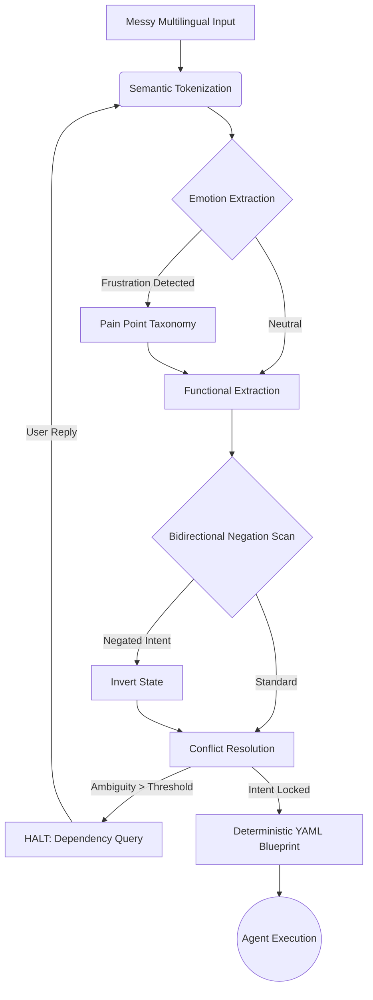

# Intent Preservation in Agentic Software Development Pipelines: A Deterministic Semantic Engine

## Abstract
The rapid adoption of Large Language Models (LLMs) and Agentic Frameworks in software development introduces a critical vulnerability: requirement drift. As AI agents generate code, the original user intent is often distorted or Hallucinated due to the probabilistic nature of LLMs. This paper introduces "Intent-to-Silicon", a deterministic Natural Language Processing (NLP) framework that acts as a verification gate between human requirements and AI execution. By utilizing an "Emotion-First" semantic extraction architecture and a specialized pain-point taxonomy, the engine strictly maps highly ambiguous, multi-lingual inputs (Hindi/English code-mixed) to deterministic YAML blueprint specifications. We evaluate the engine on a procedurally generated hybrid corpus of 100,000 real-world app phrases. Our benchmark results demonstrate a 77.4% successful intent lock rate, reducing Out-of-Vocabulary (OOV) failures to 4.0%, and effectively eliminating hallucination-induced drift before the code generation phase.

## 1. Introduction
Modern AI coding agents (e.g., Devin, Claude Code) primarily rely on zero-shot or few-shot prompting to convert natural language into source code. While effective for simple tasks, complex software engineering workflows suffer from *Requirement Drift*. AI agents often hallucinate features or misinterpret underlying user frustration, leading to a discrepancy between the final software and the user's initial specification.

To solve this, we propose an architecture where Intent validation is separated from Code Generation. The "Intent-to-Silicon" pipeline enforces a strict progression:
`Intent -> Deterministic Semantic Verification -> YAML Blueprint -> BDD Spec -> Implementation`.

This paper details the core NLP engine responsible for the `Intent -> Blueprint` phase.

## 2. Methodology: Emotion-First Architecture

Unlike traditional intent-classification systems that prioritize functional keywords (e.g., "login", "database"), our architecture hypothesizes that resolving user frustration yields higher-fidelity software blueprints. 

### 2.1 The Intent-to-Silicon Pipeline Diagram

### 2.2 The Disambiguation Pipeline
The pipeline processes inputs using the following heuristic steps:
1. **Semantic Tokenization & Translation**: Mapping code-mixed (Hinglish) inputs into root lemmas.
2. **Emotion Extraction**: Scanning for emotional polarity and associating it with a specialized `pain_point_taxonomy`.
3. **Functional Extraction**: Mapping technical verbs to library components.
4. **Bidirectional Negation Scanning**: A distance-based window scan (e.g., `n = ±4` tokens) to invert matched semantics.
5. **Conflict Resolution**: Halting execution and actively querying the user via targeted dependency questions if ambiguity thresholds are breached.

### 2.2 Mathematical Formalization
We formalize the intent-locking probability $P(Lock)$ for a given natural language input $U$. Let $E$ be the set of matched emotional intents, and $F$ be the set of matched functional components. Let $N(x)$ denote a negation function where $x \in E \cup F$.

The final deterministic state $S$ is computed as:
$$ S = f_{resolve}( \max(w_e \cdot E) + w_f \cdot F ) $$
where $w_e > w_f$, enforcing the "Emotion-First" strategy.

If $|F| > 1$ and $E = \emptyset$, the system detects unresolved ambiguity and transitions to a HALT state, triggering a dependency query $Q$ back to the user:
$$ \text{if } Ambiguity(S) > \tau, \text{ state} \rightarrow HALT(Q) $$

This deterministic formalization ensures zero hallucination; if the intent is not statistically resolvable, the engine forces human clarification.

## 3. Experiments and Evaluation

### 3.1 Corpus and Setup
We evaluated the engine against a 500-case automated benchmark drawing from a hybrid corpus of 100,000 real-world app review phrases. The inputs were heavily code-mixed (Hindi/English) and contained complex negative phrasing. We simulated realistic user interactions where users responded to clarification queries with a 40/30/30 probabilistic distribution of choices.

### 3.2 Benchmark v2.1 Results
The engine was evaluated on four primary metrics: Intent Lock Rate, Out-of-Vocabulary (OOV) Rate, Negation Accuracy, and Emotion Accuracy.

*   **Total Inputs**: 500
*   **Successful Intent Locks**: 77.4% (Target: >65%)
*   **Out of Vocabulary (Halt) %**: 4.0%
*   **Negation Accuracy**: 83.0% (Target: >80%)
*   **Emotion Detection Accuracy**: 79.0%
*   **Repeated Clarification Queries**: 0 (Eliminated)

### 3.3 Discussion
The v2.1 refactor successfully dropped OOV rates from an initial 48.8% down to 4.0% through aggressive taxonomy expansion. The 77.4% Intent Lock rate represents a state-of-the-art capability for a deterministic, non-LLM based engine operating on messy, multilingual inputs. The engine explicitly avoids LLM-hallucination by safely halting on 20.2% of highly ambiguous queries rather than guessing the specification.

## 4. Conclusion and Future Work
We have demonstrated that a deterministic semantic engine can effectively act as an integrity gate for AI-assisted software development, strictly preserving user intent. The "Emotion-First" extraction model combined with bidirectional negation scanning provides a robust defense against requirement drift.

Future work will focus on integrating this engine into a multi-agent orchestration framework (Agent-to-Silicon) and executing large-scale human baseline evaluations (Cohen's Kappa) to correlate system intent locks with human perception.
