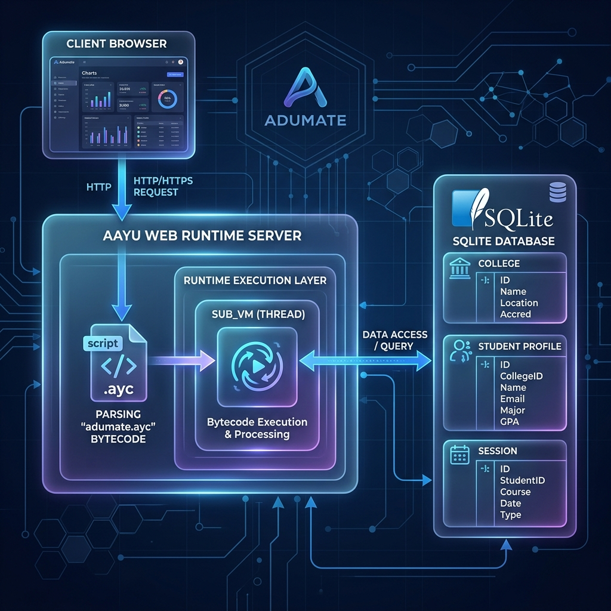

# Adumate Student Module (AAYU Showcase)

This module is the first complete, production-ready full-stack application built entirely with the **AAYU Language**. It serves as a real-world demonstration of AAYU's maturity as an application platform.

## Features

- **Core Data Entities**: Built with AAYU `entity` models (`College`, `StudentProfile`, `SavedCollege`).
- **Dynamic Routing**: Full `get` and `post` handlers.
- **Secure Authentication**: Includes `register`, `login`, and `logout` tasks that utilize AAYU's SQLite session management and cryptographically secure password hashing.
- **Protected Routes**: Utilizes the AAYU `guard session.` command to prevent unauthorized access to the dashboard.
- **Server-Side API**: A JSON-based `/api/colleges` search endpoint completely driven by AAYU.
- **Premium UIs**: Template injection natively powered by the AAYU runtime.

## Architecture



*Adumate is powered by the AAYU Web Runtime, running on the AAYU Virtual Machine. Thread isolation ensures atomic database writes via a global WAL lock.*

## How to Run

### 1. Compile the Module
Compile the raw `.aayu` source code into AAYU bytecode (`.ayc`):
```bash
python ../../cli.py compile adumate.aayu
```

### 2. Start the Server
Boot up the AAYU Virtual Machine with the generated bytecode:
```bash
python ../../cli.py vm adumate.ayc
```
The application will launch locally at `http://localhost:8082`.

### 3. Seed the Database
Navigate to the seed route to initially populate the `College` database tables:
```text
http://localhost:8082/seed
```

### 4. Explore the Flow
1. **Register**: Create a new student account. Registration ensures empty fields and duplicate emails are rejected gracefully.
2. **Login**: Authenticate securely to spawn an AAYU Session.
3. **Edit Profile**: On the Dashboard, customize your student details (Age, Branch, Year).
4. **Search Colleges**: Try the search box to asynchronously filter and list colleges from the AAYU API.
5. **Bookmark**: Save a college to your profile and watch it appear in your bookmarked list.
6. **Logout**: Safely terminate the session.

## Screenshots

*(Coming soon in the screenshots folder)*
