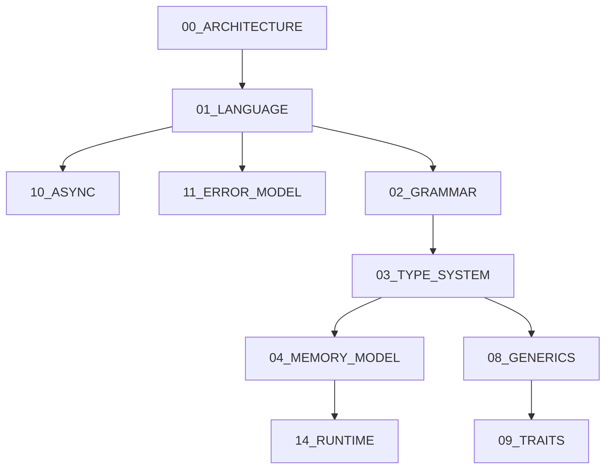

# AAYU Master Specification Index

## Specification First Policy
1. Specification changes first.
2. Compiler changes second.
3. Tests third.
4. Documentation fourth.

**Compiler MUST NEVER introduce language behavior that is not described in a Frozen Specification.**

## Dependency Graph

## Specifications Registry
- [00_ARCHITECTURE.md](./00_ARCHITECTURE.md)
- [01_LANGUAGE_SPEC.md](./01_LANGUAGE_SPEC.md)
- [02_GRAMMAR_SPEC.md](./02_GRAMMAR_SPEC.md)
- [03_TYPE_SYSTEM.md](./03_TYPE_SYSTEM.md)
- [04_MEMORY_MODEL.md](./04_MEMORY_MODEL.md)
- [05_ABI_SPEC.md](./05_ABI_SPEC.md)
- [06_MODULE_SYSTEM.md](./06_MODULE_SYSTEM.md)
- [07_PACKAGE_SPEC.md](./07_PACKAGE_SPEC.md)
- [08_GENERICS_SPEC.md](./08_GENERICS_SPEC.md)
- [09_TRAITS_SPEC.md](./09_TRAITS_SPEC.md)
- [10_ASYNC_SPEC.md](./10_ASYNC_SPEC.md)
- [11_ERROR_MODEL.md](./11_ERROR_MODEL.md)
- [12_CONCURRENCY_SPEC.md](./12_CONCURRENCY_SPEC.md)
- [13_FFI_SPEC.md](./13_FFI_SPEC.md)
- [14_RUNTIME_SPEC.md](./14_RUNTIME_SPEC.md)
- [15_SECURITY_SPEC.md](./15_SECURITY_SPEC.md)
- [16_BYTECODE_SPEC.md](./16_BYTECODE_SPEC.md)
- [17_MACHINE_LIR_SPEC.md](./17_MACHINE_LIR_SPEC.md)
- [18_STDLIB_SPEC.md](./18_STDLIB_SPEC.md)
- [19_COMPILER_API_SPEC.md](./19_COMPILER_API_SPEC.md)
- [20_VERSIONING_SPEC.md](./20_VERSIONING_SPEC.md)
